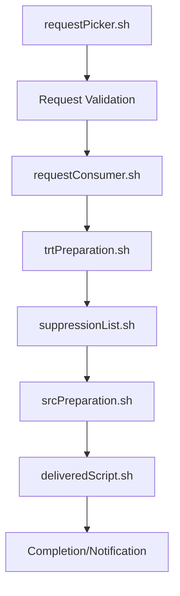

# Campaign Attribution Management (CAM)

## 🎉 **PHASE 4 - DASHBOARD IMPLEMENTATION ✅**

**Status: Dashboard Branch - Complete Analytics Dashboard with Production Optimization**  
Professional React TypeScript application for Campaign Attribution Management with authentication system, fully functional Add Request form, comprehensive Request Management & Monitoring system, and production-ready Dashboard Analytics with date filtering and system monitoring.

---

## 🚀 **Git Setup for GitHub**

### **Prerequisites**
1. Install Git: https://git-scm.com/download/windows
2. Create GitHub account: https://github.com
3. Configure Git (run once):
```bash
git config --global user.name "Your Name"
git config --global user.email "your.email@example.com"
```

### **Initialize Repository & Push to GitHub**
```bash
# 1. Navigate to project directory
cd "D:\Aamir Khan\D drive\Aamir Khan\CustomScripts\AttributionProcessingTool\Campaign-Attribution-Management"

# 2. Initialize Git repository
git init

# 3. Add all files
git add .

# 4. Create initial commit
git commit -m "🔧 Phase 4 Dashboard - UI Testing Mode

✅ Dashboard UI Implementation Complete:
- 📊 Professional dashboard interface with sample data
- 📈 Dashboard metrics cards and system status display
- ⏱️ User activity panels and quick actions
- 🚨 Sample alert system and health check functionality
- 👥 Professional layout with sample user statistics
- 🔧 Working navigation and interactive elements
- 🔍 Health check functionality with test mode alerts
- 🔄 Dashboard UI rendering successfully

Testing Mode Features:
- Authentication bypassed for UI testing (immediate test user)
- Dashboard using sample/dummy data for UI validation
- All navigation and interactive elements working
- Professional layout and styling complete
- Ready for backend API integration when stable

Frontend Features:
- Complete dashboard UI with professional styling
- Working navigation between all pages
- Interactive elements and test functionality
- Responsive design with proper spacing
- Phase 4 UI implementation ready for live data connection"

# 5. Create repository on GitHub (via web interface)
# Go to github.com → New Repository → Name: "campaign-attribution-management"

# 6. Add remote origin (replace YOUR_USERNAME with your GitHub username)
git remote add origin https://github.com/YOUR_USERNAME/campaign-attribution-management.git

# 7. Push to GitHub
git branch -M main
git push -u origin main
```

---

## ✅ **CURRENT STATUS - November 28, 2025**

### **🚀 Phase 1: Add Request Form - COMPLETE ✓**
- ✅ **Complete Form Implementation**: All 7 sections with professional UI
- ✅ **Backend API Integration**: Essential endpoints for form submission  
- ✅ **Database Integration**: Live client data and request processing
- ✅ **Enhanced Features**: New suppression types and data priority settings
- ✅ **Professional Styling**: Fixed navigation with enhanced visual design

### **🔐 Phase 2: Authentication System - COMPLETE ✓**
- ✅ **Database-Driven Login**: 48-hour session management
- ✅ **Protected Routes**: All application pages require authentication
- ✅ **Session Security**: Auto-logout and session validation
- ✅ **User Integration**: Automatic user attribution in form submissions
- ✅ **Clean Login UI**: Professional, minimal login page design

### **🚀 Phase 3: Request Management & Monitoring - COMPLETE ✓**
- ✅ **Request Table**: View all submitted requests with real-time status monitoring
- ✅ **Fixed Header Layout**: Sticky table headers with scrollable data rows for optimal viewing
- ✅ **Fixed Pagination**: Bottom pagination stays in place while data scrolls
- ✅ **Correct Database Query**: 3-table JOIN structure matching LogStreamr (requests + clients + qa_stats)
- ✅ **TRT Count Display**: Properly fetches `RLTP_FILE_COUNT` from qa_stats table
- ✅ **Updated Headers**: RequestId | Client Name | Week | AddedBy | TRTCount | Status | Description | ExecTime | Actions
- ✅ **Status Badges**: Color-coded status indicators (Waiting/Running/Error/Completed/ReRequested)
- ✅ **Individual Actions**: Action buttons (Kill, ReRun, View, Download, Upload) with proper conditional display
- ✅ **Live Backend Data**: Direct connection to PostgreSQL database for real-time data
- ✅ **Real-time Updates**: Hybrid polling approach (30s auto + manual refresh)
- ✅ **Search & Pagination**: 50 requests per page with search by ID, client, or user
- ✅ **Optimized Layout**: Professional table layout with proper spacing and alignment
- ✅ **Backend APIs**: Complete request management endpoints integrated
- ✅ **Bug Fixes**: Resolved sticky header, column alignment, and syntax errors

### **📊 Phase 4: Dashboard Analytics & Monitoring - ✅ COMPLETE**
- ✅ **Campaign Attribution Management Analytics**: Professional analytics dashboard with live database integration
- ✅ **Advanced Date Filtering**: 5 comprehensive date filter options (Week to Date default, This Week, Month, MTD, YTD)
- ✅ **Focused Metrics**: 5 essential metric cards with auto-refresh and date-range filtering
- ✅ **Alert Monitoring**: Real-time alerts for long-running requests and system health
- ✅ **User Analytics**: Date-filtered user activity tracking with performance metrics
- ✅ **Backend APIs**: Complete dashboard endpoints with PostgreSQL integration and date range support
- ✅ **Production Optimized**: Streamlined for Linux deployment with separate database partitions
- ✅ **Professional UI**: Clean 2-column layout with responsive Tailwind CSS design
- ✅ **Error Handling**: Comprehensive fallbacks and loading state management
- ✅ **Dynamic Filtering**: Real-time metric updates based on selected date ranges
- 🔄 **Auto-refresh**: Live data updates with manual refresh capability (respects date filters)
- 🎯 **Production Ready**: Optimized dashboard system ready for Linux server deployment

## 🚀 **Quick Start**

### **Prerequisites**
- Python 3.12+ with virtual environment `CAM_Env`
- Node.js 18+ with npm
- PostgreSQL database access

### **Start Application**
```bash
# Terminal 1: Start Backend
.\CAM_Env\Scripts\Activate.ps1
cd backend
python simple_api.py

# Terminal 2: Start Frontend  
cd frontend
npm run dev
```

### **Access Points**
- **Application**: http://localhost:3009
- **Backend API**: http://localhost:5000
- **Health Check**: http://localhost:5000/health

### **Login Credentials**
Database table: `apt_custom_apt_tool_user_details_dnd`

```
*New users can be added directly to the database table*

## 📋 **Phase 4 Dashboard Features**

### **📊 Campaign Attribution Management Analytics**
- **Real-time Analytics Dashboard**: Live data from PostgreSQL with auto-refresh and date filtering
- **Production-Optimized Layout**: Clean 2-column design optimized for Linux server deployment
- **Comprehensive Date Filtering**: Dynamic metrics based on selected time periods

### **📅 Advanced Date Filtering System**
- **Week to Date** (Default): Monday to current day - optimal for weekly tracking
- **This Week**: Complete Monday to Sunday view
- **This Month**: Full calendar month view
- **Month to Date**: First day of month to current day
- **Year to Date**: January 1st to current day
- **Custom Range**: Future enhancement for date picker functionality
- **Dynamic Updates**: All metrics and user activity automatically filter by selected date range

### **📈 Essential Metrics Cards (5 Cards)**
- **Total Requests**: All requests within selected date range with trend indicators
- **Active Requests**: Currently running requests with real-time status updates
- **Completed**: Successfully finished requests within date range
- **Failed Requests**: Error requests requiring attention with alert integration
- **Average Execution Time**: Performance metric for selected time period

### **🚨 Alert & Monitoring System**
- **Long Running Alerts**: Requests exceeding 2-hour threshold with request details
- **System Health Monitoring**: Real-time alert system with severity indicators
- **Clean Alert Panel**: Professional alert display with action-oriented messaging

### **👥 User Activity & Performance (Date-Filtered)**
- **Dynamic User Statistics**: Activity tracking based on selected date filter
- **Performance Metrics**: Success rates and execution times for chosen time period
- **User Rankings**: Performance analysis within selected date range
- **Consistent Filtering**: User activity follows same date selection as main metrics

### **🎯 Quick Actions Panel**
- **Add Request**: Direct navigation to Add Request form
- **View Monitor**: Navigate to Request Monitor with current filters
- **Health Check**: Comprehensive system diagnostics
  - Database connectivity test
  - API endpoint validation
  - Processing queue status verification

### **🔄 Real-time Updates & Performance**
- **Auto-refresh**: 5-minute intervals respecting current date filter (configurable in app.yaml)
- **Manual Refresh**: On-demand data refresh with loading indicators
- **Date-Aware Updates**: All refreshes maintain selected date range
- **Optimized Queries**: Backend optimized for date-range filtered queries
- **Configuration-Driven**: Refresh intervals and settings easily adjustable in app.yaml

### **🎨 Production-Ready User Experience**
- **Loading States**: Professional indicators during data fetch operations
- **Error Handling**: Graceful fallback when backend services unavailable
- **Responsive Design**: Optimized for both desktop and mobile viewing
- **Linux Deployment Ready**: Designed for separate database and application partitions

## 📋 **Phase 3 Features**

### **📊 Request Management & Monitoring**
- **Real-time Request Table**: Live data from PostgreSQL with auto-refresh (30s intervals)
- **Professional Layout**: Sticky headers, fixed pagination, optimized column widths
- **Comprehensive Search**: Multi-field search by Request ID, Client Name, or Added By user
- **Status Management**: Color-coded badges (Waiting/Running/Completed/Error/ReRequested)
- **Action Controls**: Conditional action buttons based on request status
- **Database Integration**: Proper 3-table JOIN matching original LogStreamr architecture

### **🔧 Technical Improvements**
- **Fixed Header Issue**: Resolved sticky header covering action buttons during scroll
- **Column Alignment**: Perfect header-to-data column alignment with fixed widths  
- **Layout Optimization**: Eliminated gray background gaps and spacing issues
- **Syntax Fixes**: Resolved all compilation errors and duplicate code issues
- **Button Consistency**: Uniform action button styling and spacing
- **Data Formatting**: Proper number formatting for TRT counts and execution times

### **🔐 Authentication System**
- **Secure Login**: Database-driven authentication
- **Session Management**: 48-hour sessions with automatic cleanup
- **Route Protection**: All pages require valid authentication
- **User Context**: Automatic username tracking in form submissions

### **📝 Add Request Form**
**7 Color-coded sections with professional styling:**

1. **Client Information** (Slate gradient)
   - Live client dropdown from database
   - Add new client functionality
   - Request type selection (Type1/Type2/Type3)
   - Conditional unique decile report path

2. **Campaign Dates** (Amber gradient)  
   - Start/End date validation
   - Optional residual date
   - Week field with validation
   - Real-time date logic validation

3. **File Options** (Green gradient)
   - Sent/Delivered file type selection
   - Add TimeStamp with conditional path field
   - Add Bounce and Add IPs options

4. **Report Paths** (Yellow gradient)
   - Report path and Quality Score path fields
   - File path validation

5. **Suppression List** (Violet gradient)  
   - Offer Suppression
   - Client Suppression with file path
   - **NEW**: Request ID Suppression (comma-separated IDs)

6. **Data Priority Settings** (Blue gradient)
   - **NEW**: Priority file path
   - **NEW**: Priority percentage (1-100 range)

7. **SQL Query** (Rose gradient)
   - Custom SQL input with validation

### **🗄️ Database Enhancements**
**New columns added for Phase 2:**
```sql
request_id_supp varchar        -- Comma-separated request IDs for suppression  
priority_file varchar          -- Priority file path
priority_file_per int         -- Priority percentage (1-100)
timestamp_report_path varchar  -- TimeStamp report path
```

### **🔧 Technical Features**
- **Real-time Validation**: Comprehensive form validation with error messages
- **Conditional Fields**: Dynamic field display based on selections
- **Success Handling**: Modal with generated request ID
- **Error Management**: User-friendly error states and messages
- **Responsive Design**: Professional appearance on all device sizes

## 🔗 **API Endpoints**
```
Authentication:
POST /api/login           - User authentication
POST /api/logout          - User logout  
GET  /api/session_info    - Session verification

Application:
GET  /health              - Server health check
GET  /api/clients         - Client list from database
POST /check_client        - Validate client existence
POST /add_client          - Add new client
POST /submit_form         - Process form submission

Request Management (Phase 3):
GET  /api/requests                    - List requests with pagination & search
                                       (3-table JOIN: requests + clients + qa_stats)
GET  /api/requests/{id}/details       - Get detailed request information
POST /api/requests/{id}/rerun         - Trigger request rerun (Type1/Type2/Type3)
POST /api/requests/{id}/kill          - Kill/Cancel request
GET  /api/requests/status-counts      - Get status summary counts

Dashboard Analytics (Phase 4):
GET  /api/dashboard/metrics           - Key dashboard metrics and counts
GET  /api/dashboard/trt-volume        - TRT volume chart data with date filters
GET  /api/dashboard/processing-time   - Processing time trends over 30 days
GET  /api/dashboard/alerts            - System alerts and long-running requests
GET  /api/dashboard/users             - User activity and performance metrics
GET  /api/dashboard/system-status     - System health and resource monitoring
POST /api/dashboard/health-check      - Comprehensive system diagnostics
GET  /api/dashboard/export            - Export dashboard reports (future enhancement)
```

## 🗂️ **Database Schema Integration**
```sql
-- Core Query Structure (matching LogStreamr apt-tool.py):
SELECT 
    a.request_id,
    UPPER(LEFT(b.client_name,1)) || LOWER(SUBSTRING(b.client_name,2)) as client_name,
    a.week,
    a.added_by,
    COALESCE(c.rltp_file_count, 0) as trt_count,
    a.request_status,
    a.request_desc,
    COALESCE(a.execution_time, '-') as execution_time
FROM apt_custom_postback_request_details_dnd a
JOIN apt_custom_client_info_table_dnd b ON a.client_id = b.client_id
LEFT JOIN apt_custom_postback_qa_table_dnd c ON a.request_id = c.request_id
ORDER BY a.request_id DESC
```

## 🏗️ **Project Structure**
```
Campaign-Attribution-Management/
├── backend/
│   ├── simple_api.py       # Flask API server with authentication
│   ├── config/             # Database & app configuration  
│   └── requirements.txt    # Python dependencies
├── frontend/
│   ├── src/
│   │   ├── components/
│   │   │   ├── Auth/       # Authentication components
│   │   │   ├── Forms/      # AddRequestForm components
│   │   │   └── Layout/     # Navigation and layout
│   │   ├── pages/
│   │   │   ├── AddRequest.tsx      # Main form page  
│   │   │   ├── Login.tsx           # Authentication page
│   │   │   ├── RequestLogs.tsx     # Request management & monitoring
│   │   │   └── Dashboard.tsx       # Future features placeholder
│   │   ├── services/       # API and authentication services
│   │   └── utils/          # Form validation utilities
│   └── package.json
├── shared/
│   └── config/             # Shared configuration files
└── CAM_Env/               # Python virtual environment
```

## 💻 **Technology Stack**
- **Frontend**: React 19 + TypeScript + Vite + Tailwind CSS
- **Backend**: Flask + PostgreSQL + Session Management
- **Validation**: React Hook Form + Yup schema validation  
- **Database**: PostgreSQL (`apt_tool_db`)
- **Authentication**: Custom session-based auth system

## 🛡️ **Production Ready Features**
- ✅ **Security**: Input validation, session management, protected routes
- ✅ **Performance**: Optimized form handling, database queries, and real-time updates
- ✅ **Maintainability**: Clean code architecture with TypeScript
- ✅ **Scalability**: Configuration-driven design for easy expansion  
- ✅ **User Experience**: Professional UI with comprehensive error handling
- ✅ **Reliability**: Robust error handling with graceful fallbacks
- ✅ **Data Integrity**: Proper database connections and query optimization

## 📈 **Recent Improvements & Fixes**

### **December 5, 2025 - REQUEST PAGE MAJOR UI/UX OVERHAUL ✅**
- 🎨 **Modern Table Header Design**: 
  - Rounded border edges (`first:rounded-tl-lg last:rounded-tr-lg`)
  - Gradient background (`bg-gradient-to-r from-blue-50 to-indigo-100`)
  - Removed vertical cell borders for seamless appearance
  - Larger, bolder font (`text-base font-bold text-gray-800`)
  - Enhanced visual appeal with blue gradient theme

- 📐 **Fixed Column Widths with Truncation**:
  - All table columns now have fixed widths to prevent overflow
  - Text truncation with `...` for values exceeding column width
  - Hover tooltips showing complete values (`title` attributes)
  - Improved data density and readability

- ✏️ **New Edit Button Implementation**:
  - Edit icon (`MdEdit`) with green color scheme
  - Appears only for Cancelled/Killed (`E`) or Completed (`C`) requests
  - Will open Add Request form with pre-filled data (future implementation)
  - Includes rerun module selection functionality

- 🔄 **Enhanced ReRun Module Selection**:
  - Updated dropdown with 7 proper module options:
    1. TRT, 2. Responders, 3. Suppression, 4. Source, 5. Delivered Report, 6. TimeStamp Appending, 7. IP Appending
  - Backend integration with error_code mapping (1-7)
  - Database update: `SET request_status='RE', error_code={module_number}, request_validation=NULL`

- 💬 **Custom Confirmation Modals**:
  - Replaced all browser `alert()` calls with professional custom modals
  - `ConfirmationModal` component with customizable styling
  - Consistent UI experience across all action buttons
  - No more "localhost says..." browser dialogs

- 🎯 **Improved Visual Design**:
  - Center-aligned table content for better readability
  - Lighter border colors (`border-gray-100`) for subtle separation
  - Enhanced hover effects (`hover:bg-blue-25`)
  - Professional spacing and typography improvements

**Technical Implementation:**
```typescript
// New Edit Button Logic
const EditButton: React.FC<{ request: Request }> = ({ request }) => {
  // Only show for Cancelled/Killed (E) or Completed (C) status
  if (!['E', 'C'].includes(request.request_status)) {
    return <span></span>;
  }
  // Custom modal + navigation to AddRequest form with pre-filled data
};

// Enhanced ReRun Backend Logic
module_error_codes = {
  'TRT': 1, 'Responders': 2, 'Suppression': 3, 'Source': 4,
  'Delivered Report': 5, 'TimeStamp Appending': 6, 'IP Appending': 7
}
UPDATE requests SET request_status='RE', error_code=%s, request_validation=NULL
```

### **December 5, 2025 - FRONTEND DASHBOARD FIX ✅**
- 🔧 **Waiting Requests Display Fix**: Fixed frontend Dashboard component missing `waiting_requests` field extraction
- 📊 **Complete Metrics Processing**: Frontend now properly processes all 6 metrics from backend API response
- 💾 **State Management Fix**: Updated both success and error state handling to include `waiting_requests: 0`
- 🎯 **Data Consistency**: Dashboard UI now displays correct waiting requests count (4) matching backend data
- ✅ **Visual Update**: Yellow "Waiting" card now shows live count instead of always showing zero
- 🔍 **Root Cause**: Frontend was only extracting 5 metrics fields but backend was sending 6 fields

**📊 Frontend Metrics Processing Now Complete:**
```typescript
// Before: Missing waiting_requests
setMetrics({
  total_requests: Number(metrics.total_requests) || 0,
  active_requests: Number(metrics.active_requests) || 0,
  completed_today: Number(metrics.completed_today) || 0,
  failed_requests: Number(metrics.failed_requests) || 0,
  avg_execution_time: Number(metrics.avg_execution_time) || 0
});

// After: Complete metrics extraction
setMetrics({
  total_requests: Number(metrics.total_requests) || 0,
  active_requests: Number(metrics.active_requests) || 0,
  waiting_requests: Number(metrics.waiting_requests) || 0, // ✅ ADDED
  completed_today: Number(metrics.completed_today) || 0,
  failed_requests: Number(metrics.failed_requests) || 0,
  avg_execution_time: Number(metrics.avg_execution_time) || 0
});
```

### **December 5, 2025 - DATABASE QUERY ALIGNMENT ✅**
- 🔧 **Date Filter Fix**: Updated dashboard metrics API to use `created_date` instead of `request_start_time`
- 📊 **Query Consistency**: All dashboard endpoints now use consistent date filtering logic
- 🎯 **Accurate Counts**: Dashboard metrics now match manual database validation queries
- 📈 **User Activity Fix**: Fixed user activity endpoint to use same date column as metrics
- 🔍 **Debug Logging**: Added debug logging to show expected SQL query for validation
- ✅ **Count Verification**: Dashboard API results now match `SELECT count(1), request_status FROM table WHERE created_date >= 'date' GROUP BY request_status`
- 💾 **Consistent Standards**: All date filtering standardized on `created_date` column across all endpoints

**📊 Expected Results After Fix:**
```sql
-- Your validation query:
SELECT count(1), request_status FROM apt_custom_postback_request_details_dnd_test 
WHERE created_date >= '2025-12-01 00:00:00' GROUP BY request_status;

-- API should now return matching counts:
-- Total: 76 (67+4+1+4), Active: 1, Waiting: 4, Completed: 67, Failed: 4
```

### **December 4, 2025 - DASHBOARD ENHANCEMENTS ✅**
- 🔽 **Collapsible User Activity**: Made user activity section collapsible with expand/collapse toggle
- ⏳ **Waiting Requests Metric**: Added new "Waiting" requests card to show requests with status 'W'
- 📊 **Enhanced Metrics Layout**: Updated grid layout to accommodate 6 metric cards (was 5)
- 🎯 **Better UX**: User activity now collapsed by default, expandable on demand
- 📈 **Status Visibility**: Clear separation between Waiting, Active, Completed, and Failed requests
- 🗂️ **Organized Layout**: Improved dashboard organization with cleaner visual hierarchy
- 💾 **Backend Support**: Added `waiting_requests` query to dashboard metrics API endpoint

### **December 4, 2025 - DATABASE SCHEMA ALIGNMENT ✅**
- 🔧 **Column Mapping Fixed**: Updated `/add_request` endpoint to use correct PostgreSQL column names
- 📊 **Schema Compliance**: Removed non-existent columns (`options`, `offer_option`, `bounce_option`, `cs_option`, `file_type`)
- 🗄️ **Correct Columns Used**: Updated to use actual schema columns (`unique_decile_report_path`, `from_date`, `on_sent`, etc.)
- 🎯 **Date Fields Fixed**: Properly map `start_date` → `from_date`, `file_path` → `unique_decile_report_path`
- 💾 **Database Insert Success**: Form submissions now successfully create database records
- ✅ **Production Ready**: Both `/add_request` and `/submit_form` endpoints working with correct schema
- 🔍 **Schema Validated**: All 34 database columns properly mapped and handled
- 📝 **Request Creation**: Proper `request_id` generation and return to frontend

### **December 4, 2025 - PHASE 5.1: SIMPLE SINGLE-PAGE FORM** ✅ **FINAL**
- 📄 **Single-Page Layout**: All 7 sections visible on one page with thin border separators
- 🎨 **Clean Design**: White background with subtle gray dividers between sections
- 🔢 **Numbered Sections**: Clear section numbering (1-7) with colored numbers and icons
- ✅ **All Sections Complete**: All 7 form sections migrated and functional
  - 1. 👤 Client Information (Blue)
  - 2. 📅 Campaign Dates (Orange)
  - 3. 📁 File Options (Green)
  - 4. 📊 Report Paths (Yellow)
  - 5. 🚫 Suppression List (Purple)
  - 6. ⚡ Data Priority Settings (Indigo)
  - 7. 💻 SQL Query (Pink)
- 🎯 **Simple Navigation**: Scroll through form naturally, no collapsing needed
- 📝 **Full Validation**: React Hook Form + Yup validation integrated
- 💾 **Conditional Fields**: Dynamic field display based on user selections
- 🚀 **Production Ready**: Clean, professional, easy to use

**Design Philosophy:**
- ✅ Single continuous form - no accordion complexity
- ✅ Thin border lines separate sections (`border-b border-gray-200`)
- ✅ Color-coded section headers for visual organization
- ✅ All content visible at once - no hidden sections
- ✅ Professional and straightforward user experience
- ✅ Mobile responsive layout

**Component:**
- `AddRequestFormSimple.tsx` - Complete single-page form (~700 lines)

**Next Steps:**
- Add file upload functionality for Report Paths section (Phase 5.2)
- Create backend upload & validation API (Phase 5.3)

### **December 4, 2025 - TABLE HEADER ENHANCEMENT ✅**
- ⬆️⬇️ **Center Alignment**: Changed table cells from `align-top` to `align-middle` for vertical center alignment
- 🎯 **Balanced Layout**: Content now centered vertically within cells for professional appearance
- 🔘 **Action Buttons**: Updated button container from `items-start` to `items-center` for perfect vertical centering
- 📊 **Consistent Alignment**: All content (text, badges, buttons) now vertically centered in their cells
- 👁️ **Visual Balance**: Modern, balanced table design with proper vertical spacing

### **December 4, 2025 - TABLE HEADER ENHANCEMENT ✅**
- 📏 **Bottom Border Added**: Added prominent 2px bottom border to table header (`border-b-2 border-gray-400`)
- 🔤 **Darker Header Font**: Changed header text color from `text-gray-600` to `text-gray-700` for better contrast
- ✨ **Visual Separation**: Clear visual separation between header and table content
- 🎯 **Professional Look**: Enhanced header prominence with darker text and defined border
- 👁️ **Better Readability**: Improved contrast makes headers stand out more clearly

### **December 4, 2025 - REFINED TABLE STYLING ✅**
- 🎨 **White Header Background**: Changed table header background from gray to clean white for modern look
- 🔤 **Lighter Header Font**: Updated header text from bold black to semibold gray (`text-gray-600 font-semibold`) for softer appearance
- 📝 **Lighter Content Font**: Changed table content from dark gray-900 to lighter gray-700 for better readability
- 🎯 **Professional Aesthetic**: Softer, more refined table styling with reduced visual weight
- ✨ **Modern Design**: Clean white-on-white design with subtle gray text for contemporary look
- 👁️ **Enhanced Readability**: Lighter colors reduce eye strain while maintaining clear visibility

### **December 4, 2025 - CUSTOM CANCEL CONFIRMATION DIALOG ✅**
- 💬 **Professional Confirmation Modal**: Replaced browser's `window.confirm()` with custom modal dialog
- 🚫 **Eliminated "localhost says..."**: No more browser-specific confirmation prefixes
- 🎨 **Professional UI**: Clean modal with logout icon, clear messaging, and hover effects
- 📝 **User-Friendly Text**: Simple "Do you still want to logout?" with Cancel/Logout buttons
- 🔒 **Better UX**: Modal overlay with proper focus management and responsive design
- ✨ **Production Polish**: Final user experience enhancement before GitHub commit

### **November 28, 2025 - API Cleanup & UX Improvements**
- 🧹 **Test API Cleanup**: Removed all development test endpoints (`/test_simple`, `/test_request_data`, `/test_backend`, `/test_users`)
- 🔧 **Production API Focus**: Streamlined API documentation to show only production endpoints
- 💬 **Enhanced Logout UX**: Improved logout confirmation dialog with professional formatting and clear information
- ⚡ **Code Optimization**: Eliminated unused development code for better performance and maintainability
- 📋 **Clean Documentation**: Updated startup logs to show only production-ready API endpoints

### **November 28, 2025 - Manual Width Optimization**
- 📐 **Custom Padding Adjustment**: User manually optimized `paddingLeft` from `240px` to `100px`
- 🎯 **Maximum Content Width**: Achieved significant width increase for table content area
- ⚡ **Space Utilization**: Content now starts much closer to the left edge for better space usage
- 🎨 **Layout Customization**: Tailored spacing to achieve desired content-to-sidebar relationship

### **November 28, 2025 - MainContent Background Elimination**
- 🎯 **Background Container Removal**: Eliminated all background styling from MainContent component that was creating centered layout
- 📐 **Direct Content Rendering**: Removed inner div wrapper that was constraining content width
- 🗄️ **Transparent MainContent**: MainContent now acts as transparent positioning layer without any visual styling
- 📱 **Full Width Achievement**: Content now uses absolute full width from sidebar to screen edge without containers
- ⚡ **Layout Simplification**: Eliminated the "page content" paradigm in favor of direct full-width rendering
- 🎨 **Teams-like Structure**: Achieved true two-element layout (sidebar + direct content) without background areas

### **November 28, 2025 - Complete Gap Elimination**
- 🎯 **Zero Gray Gap**: Eliminated all gray space between sidebar and table content
- 📐 **Exact Alignment**: MainContent left padding set to exact sidebar width (240px)
- 🗄️ **Database Query Fix**: Fixed SQL query error - `execution_time` now correctly referenced from requests table (table 'a') instead of qa_stats table (table 'c')
- 💾 **Client Name Formatting**: Updated to LogStreamr format with proper capitalization (UPPER(LEFT) + LOWER(SUBSTRING))
- 📊 **TRT Count Fix**: Ensured proper retrieval of `RLTP_FILE_COUNT` from qa_stats table via LEFT JOIN
- 🎨 **Layout Optimization**: Eliminated excessive gray background spacing and padding issues
- 🐛 **Syntax Error Fix**: Resolved duplicate code and compilation errors in RequestLogs component
- 🔄 **Header Names**: Updated to exact specifications (RequestId, AddedBy, TRTCount, ExecTime, etc.)
- 🎛️ **Button Spacing**: Fixed action button alignment with consistent spacing
- 💾 **Component Cleanup**: Reverted over-styled components back to clean, professional appearance
- ⚡ **Performance**: Optimized component structure for better rendering

### **November 27, 2025 - Phase 3 Polish & Bug Fixes**
- 🔧 **Sticky Header Fix**: Resolved issue where action buttons appeared in header area during scroll
- 🎯 **Column Alignment**: Perfect alignment between table headers and data columns
- 🗄️ **Database Query Fix**: Corrected 3-table JOIN to properly fetch TRT count from qa_stats table
- 📊 **TRT Count Display**: Now correctly shows `RLTP_FILE_COUNT` from qa_stats instead of purged column
- 🎨 **Layout Optimization**: Eliminated excessive gray background spacing and padding issues
- 🐛 **Syntax Error Fix**: Resolved duplicate code and compilation errors in RequestLogs component
- 🔄 **Header Names**: Updated to exact specifications (RequestId, AddedBy, TRTCount, ExecTime, etc.)
- 🎛️ **Button Spacing**: Fixed action button alignment with consistent spacing
- 💾 **Component Cleanup**: Reverted over-styled components back to clean, professional appearance
- ⚡ **Performance**: Optimized component structure for better rendering

### **November 26, 2025 - Phase 3 Implementation**
- 🚀 **Request Management**: Complete request monitoring table with real-time data
- 📱 **Responsive Design**: Professional table layout with sticky headers and pagination
- 🔍 **Search & Filter**: Multi-field search functionality
- 🎨 **Status Badges**: Color-coded request status indicators
- 🔄 **Auto-refresh**: 30-second interval updates with manual refresh option
- 🛠️ **Action Buttons**: Conditional Kill, ReRun, View, Download, Upload functionality

---
**🏆 Phase 3 Complete - Full Campaign Attribution Management System**  
*Complete CAM application with authentication, form submission, and comprehensive request monitoring*

**Recent Updates (November 27, 2025):**
- 🔧 Fixed sticky header overlapping issues
- 🎨 Optimized table layout and column alignment  
- 🐛 Resolved syntax errors and compilation issues
- 📊 Improved TRT count display from qa_stats table
- 🔄 Enhanced database query structure matching LogStreamr
- ⚡ Better performance with optimized component structure

---

## 🔧 **REQUEST PROCESSING SYSTEM - SCRIPTS FOLDER**

### **📁 SCRIPTS Folder Overview**
The SCRIPTS folder contains the complete backend processing system that handles request execution after UI submission. This system runs independently from the web application and provides the core functionality for campaign attribution processing.

### **🚀 Request Processing Workflow**

#### **1. Request Initiation Process**
```bash
# Manual initiation (current process)
sh -x ./SCRIPTS/requestPicker.sh &
```

**Process Flow:**
1. **UI Submission** → Request stored in database with status 'W' (Waiting)
2. **Manual Execution** → `requestPicker.sh` launched manually
3. **Request Validation** → Python validation script checks request integrity
4. **Processing Pipeline** → Multi-stage shell script execution
5. **Status Updates** → Real-time database updates throughout process

#### **2. Core Processing Scripts Workflow**



### **📋 Main Script Functions**

#### **🎯 requestPicker.sh**
- **Purpose**: Main daemon script that monitors for new requests
- **Functionality**:
  - Checks running request count (max 10 concurrent)
  - Selects next request with status 'W', 'RE', or 'RW'
  - Triggers request validation via `requestValidation.py`
  - Launches `requestConsumer.sh` for valid requests
- **Database Monitoring**: Continuous polling of `APT_CUSTOM_POSTBACK_REQUEST_DETAILS_DND`

#### **🔧 requestConsumer.sh**
- **Purpose**: Main consumer script that sets up request processing environment
- **Functionality**:
  - Creates request-specific directory structure under `/REQUEST_PROCESSING/{REQUEST_ID}/`
  - Copies all necessary scripts to request-specific location
  - Updates request status to 'R' (Running)
  - Launches `trtPreparation.sh` with logging
- **Directory Structure Created**:
  ```
  REQUEST_PROCESSING/{REQUEST_ID}/
  ├── FILES/     # Data files
  ├── SPOOL/     # Temporary files  
  ├── LOGS/      # Processing logs
  ├── ETC/       # Configuration files
  └── SCRIPTS/   # Request-specific scripts
  ```

#### **📊 trtPreparation.sh (Module 1)**
- **Purpose**: Prepares TRT (Treatment) data tables and starts report generation
- **Functionality**:
  - Sets request status to 'R' and records start time
  - Creates TRT report tables based on client configuration
  - Handles subsegmentation logic (Y/N)
  - Launches parallel responder pulling scripts
  - Error handling with automatic rollback

#### **🚫 suppressionList.sh (Module 3)**
- **Purpose**: Applies suppression rules to TRT data
- **Functionality**:
  - Processes client suppression files
  - Creates temporary suppression tables
  - Removes suppressed records from TRT data
  - Updates suppression count statistics
  - Handles both email-based and request-ID-based suppression

#### **🗂️ srcPreparation.sh (Module 4)**
- **Purpose**: Prepares source data for campaign execution
- **Functionality**:
  - Creates SRC (Source) tables for campaign delivery
  - Applies decile-based segmentation logic (N/Y subsegmentation)
  - Handles priority-based record selection with file and percentage
  - Manages client-specific logic (Verizon has unique key requirements)
  - Generates final delivery tables with proper constraints
  - Supports Type 1 (decile_wise_report_path) and Type 2 (unique_decile_report_path)
  - Integrates with bounce handling and IP append requirements

#### **📧 deliveredScript.sh (Module 5)**
- **Purpose**: Processes delivered data and generates final reports
- **Functionality**:
  - Creates postback (PB) table structure from SRC table template
  - Removes constraints and alters table for delivered data processing
  - Adds campaign tracking fields: campaign, subject, creative, open_date, click_date, unsub_date
  - Adds technical fields: diff, offerid, ip, timestamp
  - Processes CPM report data and integrates with delivered records
  - Handles postback data merging and deduplication
  - Creates final attribution reports for client consumption

#### **⏱️ timestampAppending.sh (Module 6)**
- **Purpose**: Adds realistic timestamps to delivered records
- **Functionality**:
  - Reads timestamp configuration from TIMESTAMP_REPORT_PATH
  - Calculates delivery rate per second based on date ranges
  - Uses Java TimeStampGenerator.jar for realistic timestamp distribution
  - Applies timestamp variance (±5 to +8 per second) for natural delivery patterns
  - Updates delivered table with calculated timestamps
  - Ensures timestamp consistency across campaign delivery windows

#### **🌐 ipAppending.sh (Module 7)**
- **Purpose**: Assigns IP addresses to delivered records
- **Functionality**:
  - Updates existing records with previously used IPs from OLD_IP_TABLE
  - Identifies records needing new IP assignments (opens without IPs)
  - Randomly selects unused IPs from NEW_IP_TABLE
  - Creates temporary REPLACE_IP_TABLE for IP assignment tracking
  - Updates delivered table with new IP assignments
  - Maintains IP uniqueness and realistic usage patterns
  - Tracks newly added IP count in qa_stats table

#### **📊 respondersPulling.sh (Module 2)**
- **Purpose**: Parallel data processing for responder information
- **Functionality**:
  - Extracts creative IDs and offer IDs from report tables
  - Determines date ranges for data processing (min/max delivery dates)
  - Pulls responder data from external systems in parallel with TRT processing
  - Processes campaign performance data for attribution
  - Runs concurrently with trtPreparation.sh for efficiency
  - Handles creative and offer-based segmentation

### **🔧 Supporting Scripts**

#### **✅ requestValidation.py**
- **Purpose**: Comprehensive request validation before processing
- **Functionality**:
  - Validates CPM report file paths and accessibility
  - Checks date ranges and format consistency
  - Validates client configuration and table existence
  - Performs data type validation for all form fields
  - Generates HTML validation reports via email
  - Updates request_validation status ('Y'/'N'/'V' for failed)
  - Connects to multiple data sources (PostgreSQL, Presto, Impala)

#### **📧 sendMail.sh & sendMail2.sh**
- **Purpose**: Email notification system for request status
- **Functionality**:
  - Generates HTML-formatted status reports
  - Sends notifications for request completion, errors, and warnings
  - Includes comprehensive request metrics and QA statistics
  - Formats data in professional HTML tables with styling
  - Sends to configurable recipient lists based on client/user
  - Integrates with all modules for status notifications

#### **🗑️ purgeScript.sh**
- **Purpose**: Cleanup and maintenance operations
- **Functionality**:
  - Removes temporary tables and files after request completion
  - Cleans up request-specific directory structures
  - Archives completed request data based on retention policies
  - Frees up disk space and database resources
  - Maintains system performance and storage efficiency

#### **🔄 trtDrop.sh**
- **Purpose**: Cleanup TRT tables and related objects
- **Functionality**:
  - Drops TRT tables after successful source preparation
  - Removes temporary indexes and constraints
  - Cleans up intermediate processing objects
  - Manages disk space during processing pipeline

### **📋 Complete Processing Workflow**

```
requestPicker.sh
    ↓
requestValidation.py ← Validates all inputs, paths, dates, client config
    ↓
requestConsumer.sh ← Sets up environment, copies scripts
    ↓
trtPreparation.sh (Module 1) ← Creates TRT tables, launches responders
    ├── respondersPulling.sh (Module 2) ← Parallel processing
    ↓
suppressionList.sh (Module 3) ← Applies suppressions
    ↓
srcPreparation.sh (Module 4) ← Creates source tables
    ↓
deliveredScript.sh (Module 5) ← Creates postback tables
    ↓
timestampAppending.sh (Module 6) ← Adds timestamps (if enabled)
    ↓
ipAppending.sh (Module 7) ← Adds IP addresses (if enabled)
    ↓
sendMail.sh ← Final notification
    ↓
purgeScript.sh ← Cleanup (optional)
```

### **🎯 Module Error Codes & Rerun Logic**

Each module has specific error codes for targeted rerun capability:

| Module | Error Code | Rerun From |
|--------|------------|------------|
| TRT | 1 | trtPreparation.sh |
| Responders | 2 | respondersPulling.sh |
| Suppression | 3 | suppressionList.sh |
| Source | 4 | srcPreparation.sh |
| Delivered Report | 5 | deliveredScript.sh |
| TimeStamp Appending | 6 | timestampAppending.sh |
| IP Appending | 7 | ipAppending.sh |

### **💾 Data Flow & Table Management**

**Primary Tables Created:**
- `APT_CUSTOM_{REQUEST_ID}_{CLIENT}_{WEEK}_TRT_TABLE` - Treatment/TRT data
- `APT_CUSTOM_{REQUEST_ID}_{CLIENT}_{WEEK}_SRC_TABLE` - Source delivery data  
- `APT_CUSTOM_{REQUEST_ID}_{CLIENT}_{WEEK}_PB_TABLE` - Postback/delivered data
- `APT_CUSTOM_{REQUEST_ID}_{CLIENT}_REPORT_TABLE` - CPM report data
- `APT_CUSTOM_{REQUEST_ID}_{CLIENT}_SUPP_TABLE` - Suppression data (temp)

**Data Sources:**
- **PostgreSQL**: Main request processing and client configuration
- **Presto**: Large-scale data queries and analytics
- **Impala**: Performance analysis and reporting
- **MySQL**: Legacy client-specific data integration

### **⚡ Performance Optimizations**

- **Parallel Processing**: TRT and Responders run concurrently
- **Indexing Strategy**: Dynamic index creation based on data volume
- **Memory Management**: Table partitioning for large datasets
- **Connection Pooling**: Efficient database connection management
- **Temporary Objects**: Strategic use of temporary tables and cleanup

### **🚨 Error Handling & Recovery**

- **Automatic Rollback**: Failed modules trigger automatic cleanup
- **Status Tracking**: Real-time status updates in database
- **Email Alerts**: Immediate notification of failures with detailed logs
- **Partial Restart**: Ability to restart from any module using error codes
- **Log Aggregation**: Centralized logging in `{REQUEST_ID}/LOGS/` directory

### **⚙️ Configuration Management**

#### **📄 config.properties**
Central configuration file containing:
- Database connection strings (PostgreSQL, Presto, Impala, MySQL)
- Directory path configurations
- Table name mappings
- Client-specific settings

#### **🔗 Database Connections**
- **Primary**: PostgreSQL for main request processing
- **Secondary**: Presto for big data queries
- **Analytics**: Impala for performance analysis
- **Legacy**: MySQL for client-specific data

### **🚨 Process Management & Cancellation**

#### **Current Kill Process**
```bash
# Find all processes for a request ID
ps -aef | grep {request-id}

# Example output for request 6989:
techteam 3014997 ... sh -x requestConsumer.sh 6989
techteam 3015093 ... sh -x trtPreparation.sh 6989  
techteam 3043835 ... sh -x suppressionList.sh 6989
techteam 3043986 ... sh -x srcPreparation.sh 6989
techteam 3117318 ... psql -U datateam ... (SQL execution)

# Kill all processes
kill -9 3014997 3015093 3043835 3043986 3117318
```

#### **⚡ Enhanced Kill System Requirements**

**Current UI Kill Logic:**
- UI calls `/api/requests/{id}/kill` endpoint
- Backend updates database status to 'E' (Error/Cancelled)
- **Gap**: No actual process termination occurs

**Enhanced Kill System Design:**
1. **Process Tracking**: Store process IDs in database during execution
2. **Hierarchical Kill**: Terminate parent and all child processes
3. **Cleanup**: Remove temporary files and rollback partial changes
4. **Status Update**: Mark request as cancelled with edit capability
5. **Notification**: Alert user of successful cancellation

**Implementation Strategy:**
```python
# Enhanced kill endpoint
@app.route('/api/requests/<int:request_id>/kill', methods=['POST'])
def kill_request_enhanced(request_id):
    # 1. Find all processes for request ID
    processes = find_request_processes(request_id)
    
    # 2. Kill processes hierarchically
    for pid in processes:
        os.system(f"kill -9 {pid}")
    
    # 3. Update database status
    update_request_status(request_id, 'E', 'Request Cancelled by User')
    
    # 4. Enable edit mode
    return jsonify({'success': True, 'edit_enabled': True})
```

### **📋 IMPROVED REQUEST CANCELLATION DESIGN SUMMARY**

#### **🎯 Solutions to User Concerns**

**1. Multiple Inserts Issue - SOLVED ✅**
- **OLD**: Multiple rows per request (one per child process)
- **NEW**: Single row per request with comma-separated PIDs
- **Benefit**: Cleaner data, easier management, no duplicate tracking

**2. Re-run Scenario Handling - SOLVED ✅**
- **Strategy**: Clear existing PIDs, append new ones
- **Function**: `clear_and_restart_tracking()` 
- **Behavior**: New processes replace old tracking data
- **No PID Conflicts**: Previous dead processes cleaned, fresh start

**3. Status Completion Tracking - SOLVED ✅**
- **Added**: `mark_request_completed()` function
- **Added**: `mark_request_failed()` function  
- **Integration**: Called from final script modules
- **Status Updates**: RUNNING → COMPLETED/ERROR/KILLED

**4. Shell-Based Kill Script - IMPLEMENTED ✅**
- **File**: `SCRIPTS/cancelRequest.sh` (dedicated script)
- **UI Integration**: Backend calls shell script via subprocess
- **Professional**: Logging, error handling, configuration-driven
- **Robust**: Handles comma-separated PIDs, child processes, fallbacks

#### **🔧 Implementation Benefits**

**Database Efficiency:**
- Single record per request (vs multiple rows)
- Comma-separated PID storage (`"123,456,789"`)
- Primary key on request_id for fast lookups
- Reduced database storage and query complexity

**Re-run Handling:**
```sql
-- Clear old PIDs and restart with new process
UPDATE apt_custom_request_process_tracking 
SET process_ids = '789',  -- New PID only
    status = 'RUNNING',
    current_module = 'TRT'
WHERE request_id = 6989;
```

**Status Lifecycle Management:**
```
W (Waiting) → R (Running) → C (Completed) ✅
                         → E (Error/Killed) ✅
```

**Professional Kill Script:**
- Dedicated `cancelRequest.sh` in SCRIPTS folder
- Database configuration driven
- Comprehensive logging and error handling
- Graceful fallback when tracking table is empty
- Child process termination before parent

#### **🚀 Usage Examples**

**Normal Request Flow:**
```bash
# 1. TRT Module starts
append_process_id 6989 "TRT"           # process_ids: "123"

# 2. Suppression Module starts  
append_process_id 6989 "SUPP"          # process_ids: "123,456" 

# 3. Source Module starts
append_process_id 6989 "SRC"           # process_ids: "123,456,789"

# 4. Request completes
mark_request_completed 6989            # status: "COMPLETED"
```

**Re-run Request Flow:**
```bash
# 1. User reruns from SRC module (error_code=4)
clear_and_restart_tracking 6989 "SRC" # process_ids: "999" (fresh start)

# 2. Delivered Module starts
append_process_id 6989 "DEL"           # process_ids: "999,888"

# 3. Request completes  
mark_request_completed 6989            # status: "COMPLETED"
```

**Cancellation Flow:**
```bash
# 1. User clicks Cancel in UI
# 2. Backend calls: ./SCRIPTS/cancelRequest.sh 6989
# 3. Script reads PIDs: "123,456,789"
# 4. Kills all processes and children
# 5. Updates status: "KILLED"
# 6. UI enables Edit button
```

#### **📊 Database Schema Comparison**

**OLD (Multiple Records):**
```sql
request_id | module_name | process_id | status
6989       | TRT        | 123        | RUNNING
6989       | SUPP       | 456        | RUNNING  
6989       | SRC        | 789        | RUNNING
```

**NEW (Single Record):**  
```sql
request_id | process_ids | current_module | status
6989       | 123,456,789 | SRC           | RUNNING
```

#### **💡 Key Improvements**

✅ **No Multiple Inserts** - Single record approach  
✅ **Re-run Safe** - Clear and restart strategy  
✅ **Status Tracking** - Complete lifecycle management  
✅ **Shell-Based Kill** - Professional dedicated script  
✅ **Child Process Handling** - Hierarchical process termination  
✅ **Fallback Logic** - Works even without tracking table  
✅ **Configuration Driven** - Easy maintenance via config.properties  
✅ **Production Ready** - Comprehensive logging and error handling

---

## 📊 **REQUEST STATISTICS VIEWING & EXPORT**

### **Overview**
Complete request statistics viewing and Excel export functionality for completed requests.

### **Features**
- **📋 Statistics Modal** - View detailed request statistics in popup
- **📥 Excel Export** - Download statistics as Excel with two sheets
- **🎨 Formatted Display** - Proper spacing and readable format
- **📊 Comprehensive Data** - Request details and logs statistics

### **Access**
1. Navigate to Request Monitor page
2. Find completed requests (Status: 'C')
3. Click **View** button (👁️ icon) in Actions column
4. Statistics popup opens with scrollable content

### **Excel Download**
- Click **"Download Excel"** button in statistics modal
- Automatically downloads: `RequestDetails-{requestId}.xlsx`
- **Two sheets included:**
  - **"Request Details"** - Core request information
  - **"Logs Details"** - Processing logs statistics

### **Data Fields**

#### **Request Details Sheet:**
- Request ID, Client Name, TRT File Count
- Request Status, Description, Start Time
- Total Execution Time, Suppression Counts
- Touch Counts, Delivery Counts
- Record Counts, IP Counts, Table Names

#### **Logs Details Sheet:**
- Actual Logs Count, TRT Match Count
- PB Reported Count, Opens Count
- Clicks Count, Match Statistics
- Generated Count Statistics

### **Backend API Endpoints**

```python
# View statistics in modal
GET /api/requests/{request_id}/stats

# Download Excel file
GET /api/requests/{request_id}/stats/download
```

---

